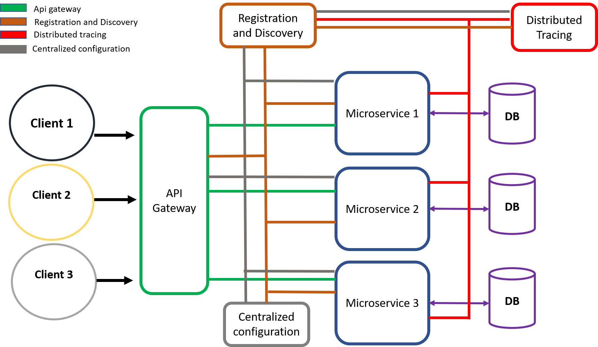
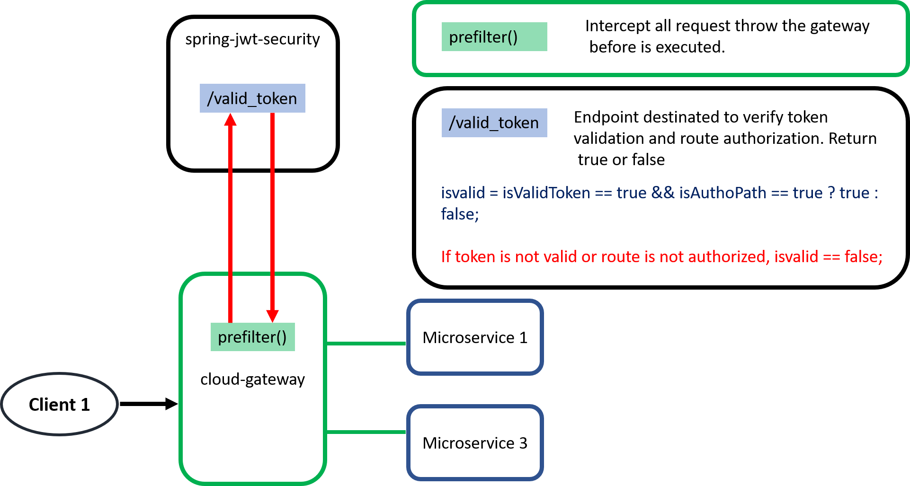
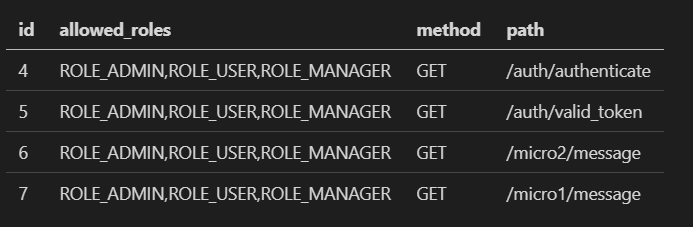

# spring-cloud-full-architecture-with-full-security

<h3>Full microservice cloud architecture using token and ACL based authorization</h3>

<h4>Authorization flow</h4>

<h4>Tests guidlines</h4>

 import Test Collection.json into POSTMAN

      
<h5> Main endpoints</h5>

      POST: http://localhost:8080/auth/authenticate

      BODY: 
      {
          "user":"user2",
          "password":"password"
      }

    GET: http://localhost:8080/micro2/message
    
    must have AUTHORIZATION HEADER = Bearer token
    
    IF token is valid and route is authorized
    
    RETURN: HELLO from microservice 2

    GET: http://localhost:8080/micro1/message
    
    must have AUTHORIZATION HEADER = Bearer token
    
    IF token is valid and route is authorized
    
    RETURN: HELLO from microservice 1
    
 <h4>ACL model</h4>
 

<strong>allowed_roles</strong> is a String variable
      
      
 <h4>Main Method to control token validation and authorization:</h4>
 
           @PostMapping(value = "/valid_token")
          public Boolean isValidRequest(@RequestBody final ValidationRequest validation_request) throws Exception {

              boolean isvalid = true;// variable para dar autorizacion
              boolean isValidToken = false;// variable para token valido o no
              boolean isAuthoPath = false;//variable para ruta autorizada o no

              final MyUserDetails userDetails1 = (MyUserDetails) SecurityContextHolder.getContext().getAuthentication()
              .getPrincipal();       
              final List<?> list_roles = new ArrayList<>(userDetails1.getAuthorities());      

              try {

                  isValidToken = jwt.validateToken(validation_request.getToken(), userDetails1);
              //    isAuthoPath = routeByRoles.get(validation_request.getPath()).contains(list_roles.get(0).toString());
                  ACLModel acl_match = new ACLModel(validation_request.getPath(), validation_request.getMethod(), null);
                  Example<ACLModel> acl_example = Example.of(acl_match);
                  List<ACLModel> acl_list = aclRepository.findAll(acl_example);

                  if (acl_list.size()== 0) {

                      isAuthoPath = false;

                  }else if(!acl_list.get(0).getAllowed_roles().contains(list_roles.get(0).toString())){

                      isAuthoPath = false;
                  }
                  else{

                      isAuthoPath = true;
                  }

              } catch (final Exception e) {

                  isvalid = false;
              }

                  isvalid = isValidToken == true && isAuthoPath == true ? true : false;
                  return isvalid;           
          }
